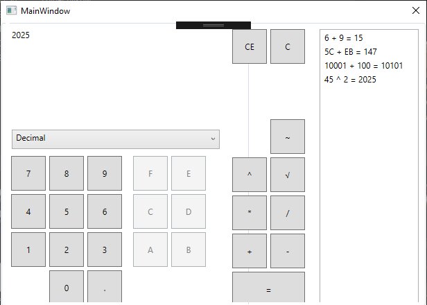

# NewCalculator

Calculator is a project that I created for college classes as an UWP application. It is a simple application that besides standard mathematical operations offers the possibility of performing operations on binary and hexadecimal numbers. The calculator also displays the history of operations, and each one can be removed. The calculator was based on the TDD principle. I wrote unit tests using the NUnit framework and later the code itself, which later turned out to be very helpful.

